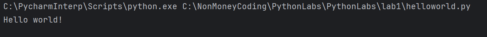
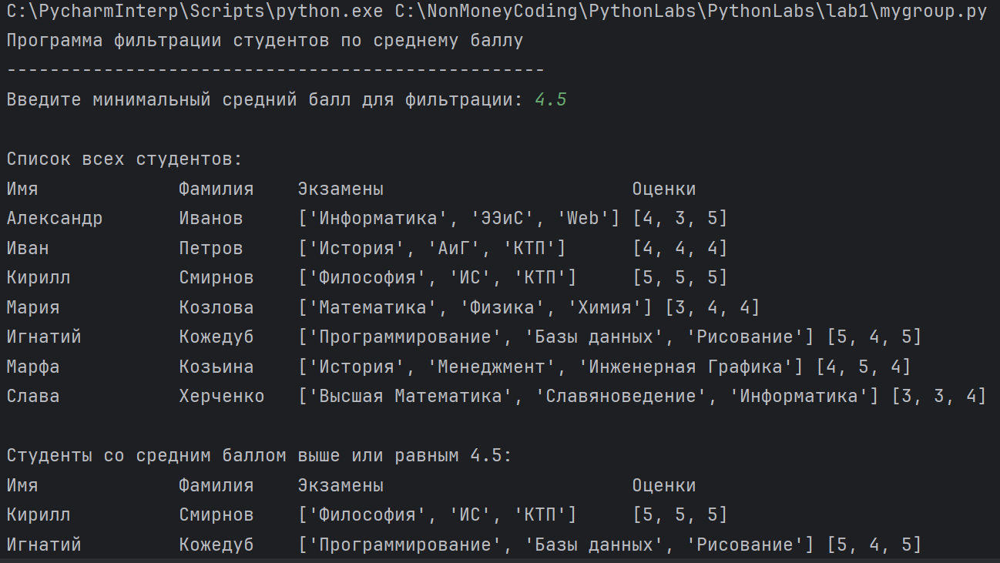
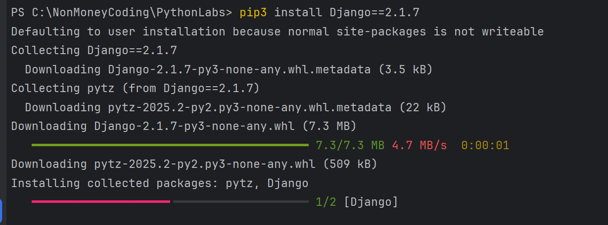
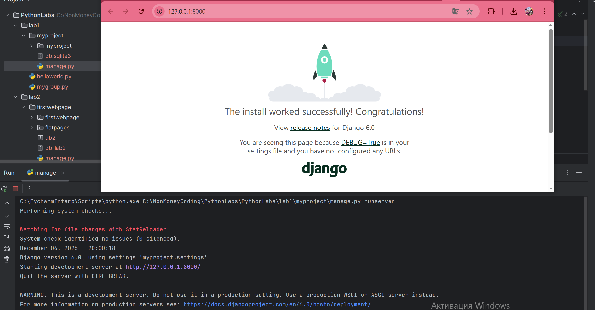
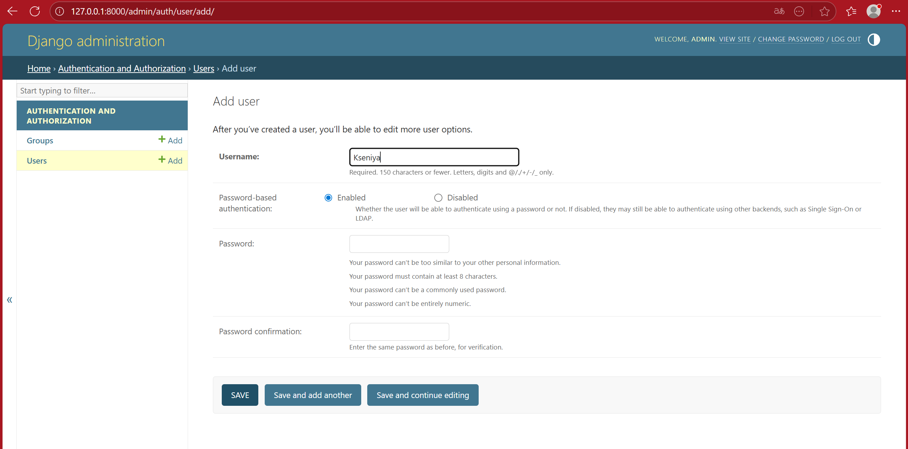
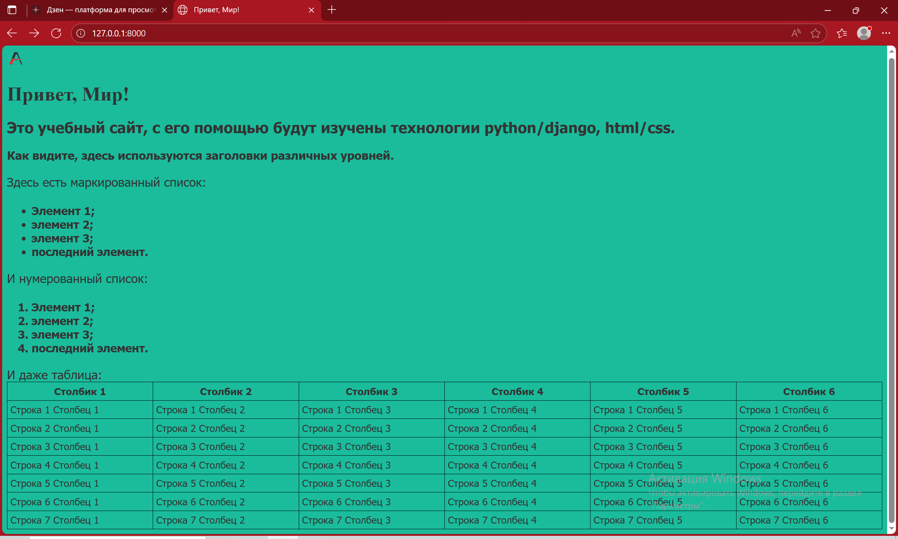
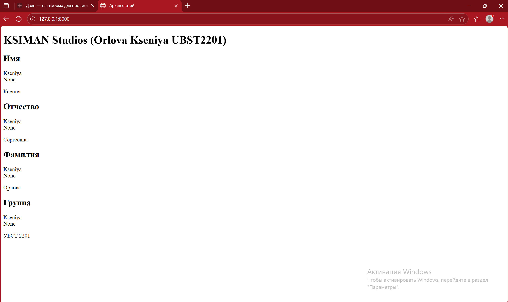

# PythonLabs
This is repo with python learning labs

First lab

hello world!

Sudents filter

Django installation

Starting web server 

Superuser panel interacting 

Second lab

Result page
Web Site

Third lab
DB data in site added by Kseniya user

